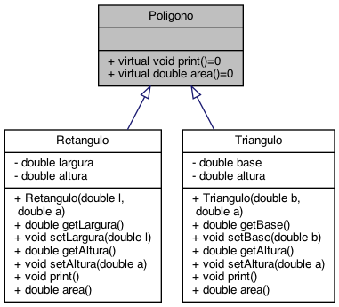

# Veiculos

## Sobre

Este programa serve à demonstração do mecanismo de herança e dos conceitos de classes abstratas e interfaces oferecidos pela linguagem de programação C++ utilizando classes que representam diferentes tipos de polígonos.

## Modelagem

Este programa agrega três classes. A classe [`Poligono`](include/poligono.h) define uma interface para um polígono qualquer, a qual contém dois métodos, um para exibir na saída padrão informações acerca desse polígono e outro para calcular a sua área. Pelo fato de ser uma classe abstrata, essa classe não pode ser instanciada na forma de objetos. Além disso, como os métodos foram definidos como virtuais puros, as classes que implementam essa interface (ou seja, dela são derivadas via herança) devem necessariamente prover uma implementação para esses métodos.

De forma simples, as classes [`Retangulo`](include/retangulo.h) e [`Triangulo`](include/triangulo.h) representam respectivamente um retângulo e um triângulo, cada uma delas provendo implementações próprias para os métodos definidos na interface [`Poligono`](include/poligono.h). O diagrama a seguir representa os relacionamentos entre as classes que compõem o programa:

<div align="center">
  
 


</div>

## Estrutura do projeto

Primando pela modularização, a definição e a implementação de cada uma das classes está separada em arquivos cabeçalho e de corpo. O arquivo [`main.cpp`](src/main.cpp) correspondente à implementação da função principal do programa. Os arquivos deste projeto estão assim organizados de acordo com a seguinte estrutura:

```text
+─poligonos               ---> Nome do diretório do projeto
  ├─── CMakeLists.txt     ---> Script de configuração do cmake
  ├─── Doxyfile           ---> Arquivo de configuração para geração de documentação com Doxygen
  ├─── build              ---> Diretório onde os arquivos executáveis serão gerados
  ├─── doc                ---> Diretório onde a documentação em HTML será gerada
  ├─── include            ---> Diretório que contém os arquivos cabeçalho (.h)
       └─── poligono.h    ---> Arquivo cabeçalho referente à definição da classe abstrata/interface Poligono
       └─── retangulo.h   ---> Arquivo cabeçalho referente à definição da classe Retangulo
       └─── triangulo.h   ---> Arquivo cabeçalho referente à definição da classe Triangulo
  └─── src                ---> Diretório que contém os arquivos corpo (.cpp)
       └─── main.cpp      ---> Arquivo fonte contendo a implementação da função principal do programa
       └─── retangulo.cpp ---> Arquivo fonte referente à implementação da classe Retangulo
       └─── triangulo.cpp ---> Arquivo fonte referente à implementação da classe Triangulo
```

## Requisitos

Para a compilação e execução deste programa, os seguintes elementos devem estar devidamente instalados no ambiente de desenvolvimento:

- [Git](https://git-scm.com), como sistema de controle de versões
- [*GNU Compiler Collection*](https://gcc.gnu.org) (a qual inclui o compilador `g++`), [`clang`](https://clang.llvm.org/) ou qualquer outro compilador para a linguagem C++
- [`cmake`](https://cmake.org/), para gerar *makefiles* automaticamente e de forma otimizada para o projeto
- [Doxygen](https://www.doxygen.nl), para geração automática de documentação

## Download, compilação e execução do programa

No terminal do sistema operacional, insira os seguintes comandos para realizar o *download* da implementação a partir deste repositório Git e navegar para o diretório resultante:

```bash
 # Download da implementação a partir do repositório Git
 git clone https://github.com/bti-ufrn-lp1/poligonos.git
 
 # Navegação para o diretório
 cd poligonos
```

Em seguida, insira os seguintes comandos no terminal do sistema operacional para gerar automaticamente o *makefile* e, em seguida, compilar o programa:

```bash
 # Criação do diretório build
 mkdir build
 cd build

 # Utilização do CMake para geração do Makefile
 cmake ..
 
 # Compilação e geração do executável do programa
 cmake --build .
```

Esses comandos irão gerar, além de um conjunto de arquivos e diretórios resultantes dos processos de compilação e ligação do programa, o arquivo executável do programa, ``poligonos``, no diretório ``build``.

Finalmente, para executar o programa gerado, basta inserir o seguinte comando no terminal do sistema operacional (a partir do diretório `build`):

```bash
 ./poligonos
```

Nesse caso, o programa irá exibir na saída padrão informações de diferentes de veículo, mais precisamente dois carros, um barco e um veículo anfíbio.